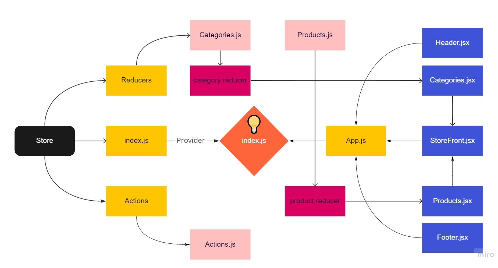
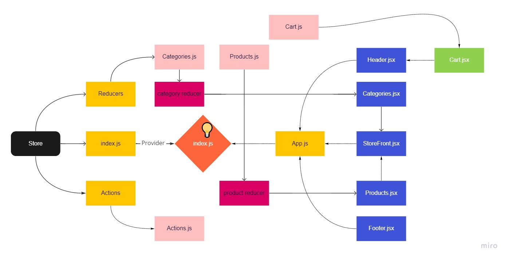

# Storefront
>
Our application will power an online storefront that will allow our users to browse our product offerings by category, place items in their shopping cart, and check-out when they are ready to make their purchase

## Auther: Abdallah Abu Khurma

## Pull Requests

[Redux](https://github.com/AbdallahAbuKhurma/storefront/pull/2)

[Combined-Reducers](https://github.com/AbdallahAbuKhurma/storefront/pull/4)

[Thunk](https://github.com/AbdallahAbuKhurma/storefront/pull/5)

## Deployment

[Netlify URL](https://store-froont.netlify.app/)

## Redux UML

## Combined-Reducers UML

## Thunk UML

